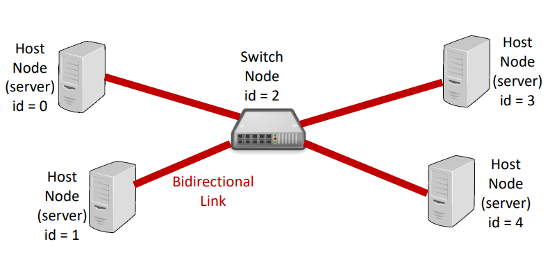

## Network Simulator

This is a network simulator that simulates hosts, switches and a domain server in c using forks.

This project is to design a c program that can simulate a simple network of computers and hosts.  The network should be able to send files as separate packets and then reassemble them at the destination host.  When the project files were supplied the simulator was only able to send files that fit in a single packet.  After implementing file splitting the next addition to the program is to implement a switch that is able to connect multiple hosts and forward packets to known hosts.  The final thing to add is a Domain Name Server that a host can register a name for themselves, and other hosts can look up by a domain name instead of a host id.

<pre>
Check out the documentation <a href="https://www2.hawaii.edu/~brewerj3/ee367/Network_simulator/">here</a>
</pre>

