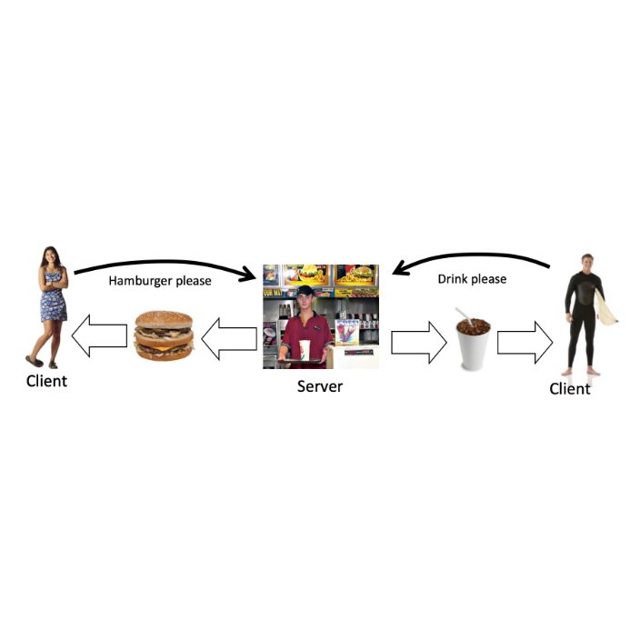

This lab implements a server that can send responses, and a client that connects to the server and can ask for documents.

<pre>
Check out the documentation <a href="https://www2.hawaii.edu/~brewerj3/ee367/Server%20Client%20Lab/">here</a>
</pre>

